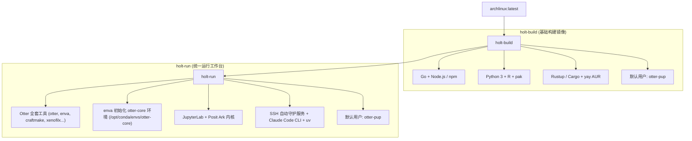

# 🦦 Holt

> **Next-Generation Containerized Workbench for Otter Bioinformatics & Multi-Language Computing**

[](https://github.com/otterlab-bio/holt/actions/workflows/holt-build.yml)
[](https://github.com/otterlab-bio/holt/actions/workflows/holt-run.yml)
[](https://github.com/orgs/otterlab-bio/packages)
[](LICENSE)

---

## 🌟 概览

**Holt** 是面向 [Otter](https://github.com/otterlab-bio/otter) 生物信息学生态及现代化多语言开发的高性能 Docker 容器套件。项目采用层次化解耦设计，将基础构建依赖与完整运行时工作台分别打包为两个镜像，全面托管于 **GitHub Container Registry (GHCR)**：

- 🛠️ **`ghcr.io/otterlab-bio/holt-build`**: 轻量级多语言基础构建层，内置 Go、Node.js / npm、Python 3、R 与 Rust，配置 yay AUR 助手与并行编译，默认非特权用户 `otter-pup`。
- 🧬 **`ghcr.io/otterlab-bio/holt-run`**: 统一生物信息学工作台与运行环境，继承自 `holt-build`，完整内置 Otter 核心工具套件，并通过 `enva` 预初始化 `otter-core` 环境，集成 JupyterLab (Ark)、SSH 服务与 AI 编程工具链。

---

## 🏗️ 架构设计



---

## 📦 镜像特性对比

| 特性 | `holt-build` (基础构建镜像) | `holt-run` (统一运行镜像) |
| :--- | :--- | :--- |
| **基础底座** | `archlinux:latest` | `ghcr.io/otterlab-bio/holt-build:latest` |
| **默认用户** | `otter-pup` (具备 sudo 权限) | `otter-pup` (具备 sudo 权限) |
| **语言与包管理器** | Go, Node.js, npm, Python 3, pip, R, pak, Rust (cargo) | 继承全部语言环境 + `uv` |
| **Otter 工具链** | — | 全套预装 (`otter`, `enva`, `craftmake`, `xenofilx`, `pairbam`, `seq2mat`, `methx`, `qctb`, `fastqcx`, `matsrun`) |
| **生信分析环境** | — | `otter-core` 预初始化 (bismark, bowtie2, samtools, star, htseq, rmats, picard, fastqc, macs2, bwa...) |
| **开发服务** | 基础终端 Shell | SSH 守护服务 (2222)、JupyterLab (8889)、Ark 内核 |
| **AI 辅助工具** | — | Claude Code CLI (`claude-code`)、Codex、droid |
| **预留服务端口** | — | `2222` (SSH), `8889` (JupyterLab), `8080`, `8787` (Web应用) |

---

## 🚀 快速上手

### 1. 拉取预构建镜像 (GHCR)

```bash
docker pull ghcr.io/otterlab-bio/holt-build:latest
docker pull ghcr.io/otterlab-bio/holt-run:latest
```

### 2. 运行容器

#### 启动 `holt-run` 工作台（推荐）

```bash
docker run -d \
  -p 2222:2222 \
  -p 8889:8889 \
  -p 8080:8080 \
  -p 8787:8787 \
  --name holt-run \
  ghcr.io/otterlab-bio/holt-run:latest
```

或使用项目内置的 `docker-compose.yml` 一键编排：

```bash
docker compose up -d holt-run
```

#### 启动 `holt-build` 基础镜像

```bash
docker run -it --name holt-build ghcr.io/otterlab-bio/holt-build:latest
```

### 3. 连接与使用

- **SSH 终端连接**（服务已自动随容器就绪）：
  ```bash
  ssh otter-pup@localhost -p 2222
  # 默认密码: otter-pup
  ```

- **启动 JupyterLab**（按需手动启动，降低闲置资源损耗）：
  ```bash
  # 直接从宿主机执行
  docker exec holt-run su - otter-pup -c "jupyter-lab --no-browser --allow-root --ip=* --port=8889" &
  ```
  浏览器打开：[http://localhost:8889](http://localhost:8889)

- **交互式创建新用户**：
  ```bash
  docker exec -it holt-run sudo add-user
  ```

---

## 🧰 Otter 生物信息学工具集成

`holt-run` 完整内置了 [otterlab-bio/otter](https://github.com/otterlab-bio/otter) 发布的独立二进制工具套件，并已全局加入 PATH：

| 工具命令 | 功能描述 |
| :--- | :--- |
| **`otter`** | 核心生信工作流编排与执行引擎 |
| **`enva`** | 基于 Rattler 的现代化高性能 Conda/Mamba 环境管理器 |
| **`craftmake`** | 统一工作流定义与依赖执行客户端 |
| **`xenofilx`** | PDX/CDX 肿瘤异种移植人鼠混合测序数据快速过滤工具 |
| **`pairbam`** | 高性能双端 BAM 匹配与比对校准工具 |
| **`seq2mat`** | 测序数据与表达/甲基化矩阵极速转换工具 |
| **`methx`** | 高通量甲基化特征提取与分析套件 |
| **`qctb`** | 质量控制与测序指标综合评估工具 |
| **`fastqcx`** | 超快 FASTQ 质控与过滤工具 |
| **`matsrun`** | rMATS 可变剪接分析执行与结果提取封装工具 |

### 运行时环境 `otter-core`

容器在构建时已通过 `enva` 将 `otter-core` 环境完整下载安装至 `/opt/conda/envs/otter-core`，并把其二进制路径添加至全局 PATH：

```bash
# 进入容器查看 otter 与生信工具
docker exec -it holt-run bash

# 运行工具
otter --version
enva list
samtools --version
bismark --version
bowtie2 --version
```

---

## 💻 多语言开发环境

### Go 开发
```bash
go version
go mod init my_app
```

### Node.js / npm 开发
```bash
node -v
npm -v
```

### Python & uv
```bash
python --version
uv pip list
```

### Rust 开发
```bash
rustc --version
cargo --version
```

### AI 辅助编程
```bash
claude-code
```

---

## 🔨 本地构建与 CI/CD

### 本地构建

```bash
# 构建基础镜像
docker build -t ghcr.io/otterlab-bio/holt-build:latest ./holt-build

# 构建运行镜像
docker build -t ghcr.io/otterlab-bio/holt-run:latest ./holt-run

# 或统一构建
docker compose build
```

### 持续集成 (GitHub Actions)

项目配置了自动构建与发布流水线（推送至 `ghcr.io/otterlab-bio`）：
- `.github/workflows/holt-build.yml`: 定时或变更时自动构建并推送 `holt-build`
- `.github/workflows/holt-run.yml`: 定时或变更时自动构建并推送 `holt-run`

---

## 📁 仓库结构

```
holt/
├── holt-build/
│   ├── Dockerfile             # 基础构建镜像 (Go, npm, Python, R, Rust, otter-pup)
│   └── makepkg.conf           # 并行编译配置
├── holt-run/
│   ├── Dockerfile             # 运行环境镜像 (Otter 全套工具, otter-core, JupyterLab, SSH)
│   ├── add_user_interactive.sh# 交互式用户配置脚本
│   └── envs/                  # otter 环境配置定义 (otter-core.yaml 等)
├── .github/workflows/
│   ├── holt-build.yml         # GHCR 构建发布工作流 (holt-build)
│   └── holt-run.yml           # GHCR 构建发布工作流 (holt-run)
├── docker-compose.yml         # 本地容器编排定义
├── README.md                  # 项目说明文档
├── CLAUDE.md                  # Claude Code 开发指南
├── LICENSE                    # MIT 开源许可证
├── .gitignore
├── .dockerignore
└── .gitattributes
```

---

## 📄 许可证

本项目基于 [MIT 许可证](LICENSE) 开源发布。
