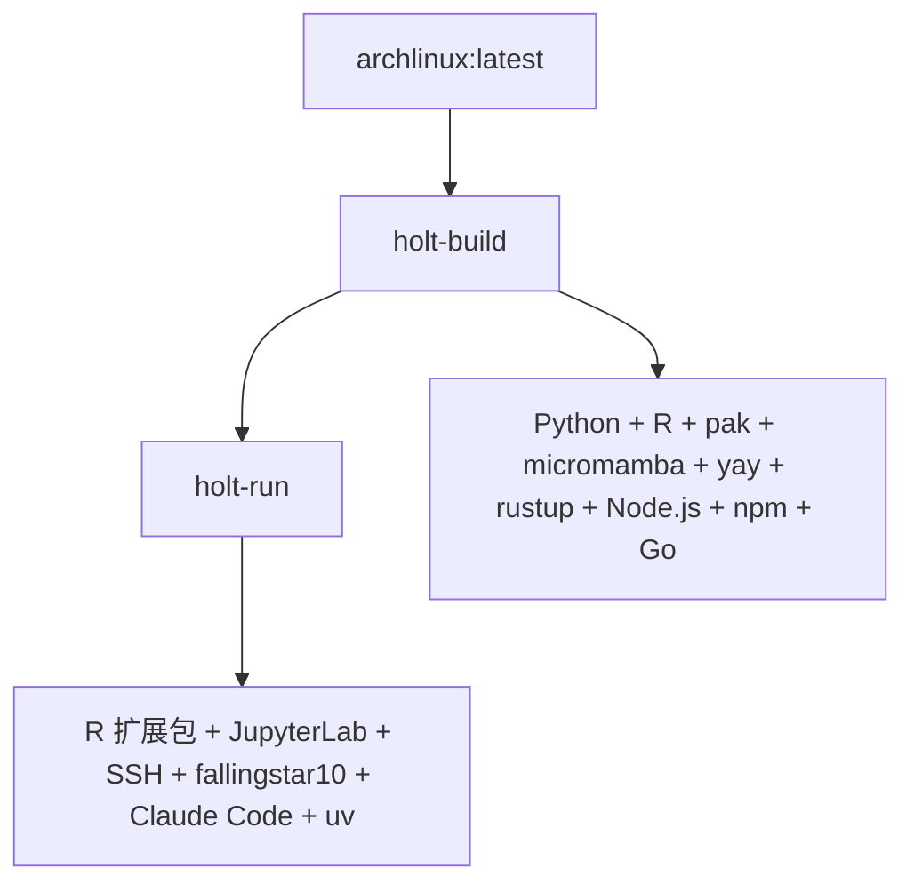

# 🌲 Holt - 生物信息学与多语言开发容器套件

[](https://github.com/rainoffallingstar/holt/actions/workflows/holt-build.yml) [](https://github.com/rainoffallingstar/holt/actions/workflows/holt-run.yml)

---

## 📦 项目概述

**Holt** 是一套面向生物信息学工作流与多语言开发的高效 Docker 容器套件 `<small>`(Efficient Docker container suite for bioinformatics workflows and multi-language development)`</small>`。容器专为高性能与极简易用设计，将复杂的跨语言环境封装为两个层次分明、相互继承的镜像：**`holt-build`** 与 **`holt-run`**。

✨ **核心特色**:

- 🐧 **基于 Arch Linux** - 轻量、前沿、高度定制的 Linux 发行版
- 🧰 **yay AUR 助手** - 强大的 Arch 用户仓库包管理
- 🐍 **Python 3** - 包含 pip、uv 与 micromamba 跨语言环境管理
- 📊 **R 语言环境** - 完整的统计分析生态（Shiny、tidyverse、mlr3verse 等）
- 📓 **JupyterLab** - 交互式计算环境（集成 Ark 增强）
- 🔧 **Ark + Air** - Posit Dev 开发工具链
- 💡 **R LSP 支持** - languageserver + lintr 代码质量工具
- 🦀 **Rust** - 高性能系统编程语言（rustup / cargo）
- 🟢 **Node.js** - JavaScript 运行时与 npm 包管理
- 🔵 **Go** - 现代化并发系统编程语言
- 🤖 **Claude Code CLI** - 全局内置 AI 辅助编程工具

容器采用精简的两层继承设计，从基础构建层逐步派生，确保每一层都有清晰的功能分工与依赖边界。

---

## 🏗️ 容器架构

### 📊 架构图



### 🎯 层次化容器结构

#### 1. **🛠️ holt-build** - 基础构建容器层

- **基础镜像**: `archlinux:latest`
- **编程语言**: Python 3, R, Rust, Node.js, Go
- **包管理器**:
  - **pip** (Python)
  - **pak** (R)
  - **micromamba** (轻量级 Conda 替代品)
  - **yay** (Arch AUR 助手)
  - **cargo** (Rust)
  - **npm** (Node.js)
  - **go mod** (Go)
- **特点**: 并行编译优化（`makepkg.conf`），非特权 AUR 构建用户 `builduser`

#### 2. **🧬 holt-run** - 统一工作与运行环境

- **继承自**: `fallingstar10/holt-build:latest`
- **R 语言生态**:
  - Shiny 生态（DT, shinyWidgets, shiny, bslib 等）
  - 统计与可视化（plotly, pROC, sva, tidyverse 等）
  - 机器学习（mlr3verse）
  - 开发工具（languageserver, lintr）
- **集成功能与服务**:
  - 📓 **JupyterLab** - 已安装，按需手动启动（默认端口 8889）
    - 集成 **Ark** (Posit Dev) - 增强 JupyterLab 的 R 开发体验
  - 🔧 **Air** (Posit Dev) - R 包管理与发布工具
  - 💡 **R 语言服务器** - languageserver + lintr 代码诊断与自动补全
  - 🔐 **SSH 访问** - 容器启动后自动就绪（端口 2222）
  - 👤 **fallingstar10 用户** - 默认工作账户（密码：fallingstar10，具备 sudo 权限）
  - 🤖 **Claude Code CLI** - 全局预装，开箱即用
  - 👥 **交互式用户管理** - 提供 `add-user` 工具一键配置新用户环境
- **预留端口**: 8080, 8787（可供 Shiny、Web 应用或自定义服务使用）

---

## 🚀 快速开始

### 使用 Docker CLI

#### 1️⃣ 拉取预构建镜像

```bash
docker pull fallingstar10/holt-build:latest
docker pull fallingstar10/holt-run:latest
```

#### 2️⃣ 运行容器

```bash
# 🛠️ holt-build - 交互式基础开发环境
docker run -it --name holt-build fallingstar10/holt-build:latest

# 🧬 holt-run - 完整工作环境（推荐）
docker run -d \
  -p 2222:2222 \
  -p 8889:8889 \
  -p 8080:8080 \
  -p 8787:8787 \
  --name holt-run \
  fallingstar10/holt-run:latest
```

#### 3️⃣ 访问服务

**SSH 访问**（服务自动启动）:
```bash
ssh fallingstar10@localhost -p 2222
# 默认密码: fallingstar10
```

**启动 JupyterLab**（按需手动启动，降低闲置资源开销）:
```bash
# 方法 1: 在容器内部启动
docker exec -it holt-run /bin/bash
su - fallingstar10 -c 'jupyter-lab --no-browser --allow-root --ip=* --port=8889 &'

# 方法 2: 从主机直接启动
docker exec holt-run su - fallingstar10 -c "jupyter-lab --no-browser --allow-root --ip=* --port=8889" &
```

浏览器访问: **http://localhost:8889**

**创建新用户**:
```bash
# 进入容器
docker exec -it holt-run /bin/bash

# 运行交互式用户管理向导
sudo add-user
```

向导将自动配置用户主目录、sudo 权限、SSH 密钥与多语言环境变量。

---

### 使用 Docker Compose

仓库内置了 `docker-compose.yml`，可快捷启动与编排容器：

```bash
# 启动 holt-run 服务
docker compose up -d holt-run

# 查看服务状态
docker compose ps

# 停止并清理
docker compose down
```

---

## 🔧 构建指南

### 🖥️ 本地构建

```bash
# 1. 构建基础镜像 holt-build
docker build -t fallingstar10/holt-build:latest ./holt-build

# 2. 构建运行镜像 holt-run
docker build -t fallingstar10/holt-run:latest ./holt-run
```

或使用 Docker Compose 统一构建：

```bash
docker compose build
```

### ⚡ CI/CD 自动构建

项目使用 **GitHub Actions** 进行自动化持续构建与镜像发布：

- **🕐 定时构建**: 每周五自动构建
  - `holt-build`: 06:00 UTC
  - `holt-run`: 08:00 UTC
- **🔔 触发条件**:
  - 📅 周期定时触发
  - 👆 GitHub 网页手动触发 (`workflow_dispatch`)
  - 📝 对应子目录（`holt-build/**` 或 `holt-run/**`）的代码 `push`
- **🚀 镜像仓库**: 自动构建并推送到 Docker Hub (`fallingstar10/holt-build` 和 `fallingstar10/holt-run`)

---

## 📋 容器详细说明

### 🛠️ holt-build 容器

**基础镜像**: `archlinux:latest`

**🧰 核心工具与版本**:

- **Python 3**: `python`, `pip`
- **R**: `r`, `pak` 包管理器
- **micromamba**: 极速轻量级 Conda 替代方案
- **yay**: AUR 包管理工具
- **Rust**: `rustup`, `rustc`, `cargo`
- **Node.js**: `node`, `npm`
- **Go**: `go`

**⚙️ 特性与优化**:

- 并行编译优化配置（`makepkg.conf`）
- 专用低权限构建账户 `builduser`
- 构建中间缓存与临时文件清理

### 🧬 holt-run 容器

**继承自**: `fallingstar10/holt-build:latest`

**🎯 主要功能**:

#### 1. 📊 R 语言环境

- **包管理器**: 使用 `pak` 进行高速并行安装与依赖解析
- **预装 R 包组**:
  - **组1 (Shiny 与数据处理)**: DT, shinyWidgets, shiny, bslib, optparse, openxlsx, XML, R6, yaml, glue, fs, png, reshape2, readxl, RColorBrewer, rjson, data.table, dbplyr
  - **组2 (统计与可视化)**: plotly, pROC, sva, sampling, pdftools, umap, gridExtra, ggpubr, tidyverse
  - **组6 (机器学习)**: mlr3verse
  - **组7 (开发者工具)**: languageserver, lintr

#### 2. 📓 JupyterLab + Posit Dev 工具

- **JupyterLab**:
  - **状态**: 预安装，按需手动启动以节省资源
  - **命令**: `su - fallingstar10 -c 'jupyter-lab --no-browser --allow-root --ip=* --port=8889 &'`
  - **端口**: 8889
  - **内核支持**: Python 3, R, Bash
- **Ark (Posit Dev)**:
  - 功能: 现代化 R 语言内核，显著增强 JupyterLab 下的 R 交互体验
- **Air (Posit Dev)**:
  - 功能: 现代化 R 语言开发与格式化工具链

#### 3. 🔐 SSH 访问

- **状态**: 容器启动自动运行
- **端口**: 2222
- **默认用户**: `fallingstar10`（默认密码：`fallingstar10`）
- **认证**: 支持密码登录与 SSH 公钥认证

#### 4. 👥 用户管理 (`add-user`)

- **位置**: `/usr/local/bin/add-user`
- **功能**: 交互式添加新用户，自动配置 sudo 权限、SSH 目录与多语言环境变量
- **执行**: `sudo add-user`

#### 5. 🤖 AI 开发工具

- **Claude Code CLI**: 全局预装，终端直接运行 `claude-code`
- **Codex / opencode-ai / droid**: 全局预装
- **uv**: 高性能 Python 包管理工具

---

## 🧪 使用示例

### Python 开发

```bash
docker exec -it holt-run /bin/bash

# 使用 micromamba 安装生物信息学工具与科学计算库
micromamba install pandas numpy scipy -y
micromamba install -c bioconda samtools -y

# 或使用 uv 进行极速包管理
uv pip install scipy
```

### R 开发

```bash
# 使用 pak 安装 R 包
R -e "pak::pkg_install(c('DESeq2', 'ComplexHeatmap'))"

# 代码静态检查
R -e "lintr::lint_dir('.')"
```

### Rust 开发

```bash
# 激活 Rust 环境（fallingstar10 用户首次使用）
source ~/.cargo/env

# 新建项目
cargo new my_tool
cd my_tool
cargo run
```

### Node.js 开发

```bash
npm init -y
npm install -g typescript
```

### Go 开发

```bash
go version
mkdir my_project && cd my_project
go mod init my_project
```

---

## ⚙️ 系统要求

- **内存**: 至少 4GB RAM（推荐 8GB 以上）
- **磁盘**: 至少 10GB 可用存储空间
- **Docker**: 20.10 或更高版本
- **平台支持**: Linux (x86_64), macOS (Intel / Apple Silicon 需配置兼容或多架构构建), Windows (WSL2)

---

## 🔍 常见问题排查

1. **查看容器运行日志**:
   ```bash
   docker logs holt-run
   ```
2. **检查 SSH 服务状态**:
   ```bash
   docker exec holt-run /bin/bash -c "ps aux | grep sshd"
   ```
3. **检查 JupyterLab 状态**:
   ```bash
   docker exec holt-run /bin/bash -c "ps aux | grep jupyter"
   ```
4. **重启运行环境**:
   ```bash
   docker restart holt-run
   ```

---

## 📄 许可证

本项目基于 [MIT 许可证](LICENSE) 开源发布。
