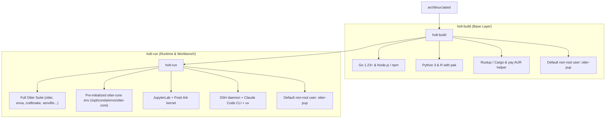

<p align="right">
  <strong>English</strong> · <a href="./README_zh.md">简体中文</a>
</p>

<h1 align="center">🦦 HOLT</h1>

<p align="center">
  <strong>Containerized Workbench for Otter Bioinformatics & Multi-Language Computing</strong><br>
  High-performance layered Docker suite featuring native Otter toolchains, enva-managed conda runtime, and modern developer tooling.
</p>

<p align="center">
  <a href="#overview">Overview</a> ·
  <a href="#architecture">Architecture</a> ·
  <a href="#quick-start">Quick Start</a> ·
  <a href="#otter-toolchain">Otter Toolchain</a> ·
  <a href="#multi-language-stack">Languages</a> ·
  <a href="#cicd--publishing">CI/CD</a> ·
  <a href="#repository-layout">Repository</a>
</p>

<p align="center">
  <a href="https://github.com/otterlab-bio/holt/actions/workflows/holt-build.yml"></a>
  <a href="https://github.com/otterlab-bio/holt/actions/workflows/holt-run.yml"></a>
  <a href="https://github.com/orgs/otterlab-bio/packages"></a>
  <a href="LICENSE"></a>
</p>

---

## 🌟 Overview

**Holt** is an enterprise-grade containerized environment engineered for the [Otter](https://github.com/otterlab-bio/otter) bioinformatics ecosystem and multi-language scientific computing. By separating compilation dependencies from runtime orchestration, Holt provides two cleanly layered container images hosted on **GitHub Container Registry (GHCR)**:

- 🛠️ **`ghcr.io/otterlab-bio/holt-build`**: Lightweight multi-language base layer built on Arch Linux. Out-of-the-box support for Go, Node.js / npm, Python 3, R, Rust (`cargo`), and the `yay` AUR helper. Runs under non-root user `otter-pup`.
- 🧬 **`ghcr.io/otterlab-bio/holt-run`**: Unified bioinformatics workbench inheriting from `holt-build`. Pre-packaged with the entire Otter tool suite, an `otter-core` conda environment pre-initialized via `enva`, JupyterLab with Posit Ark kernel, an auto-starting SSH daemon, and AI coding assistants (`claude-code`, `uv`, `codex`).

---

## 🏗️ Architecture



---

## 📦 Container Comparison

| Specification | `holt-build` (Base Image) | `holt-run` (Runtime Workbench) |
| :--- | :--- | :--- |
| **Base Image** | `archlinux:latest` | `ghcr.io/otterlab-bio/holt-build:latest` |
| **Default User** | `otter-pup` (sudo NOPASSWD enabled) | `otter-pup` (sudo NOPASSWD enabled) |
| **Languages & Package Managers** | Go, Node.js, npm, Python 3, pip, R, pak, Rust (cargo) | All base languages + Python `uv` |
| **Otter Tool Suite** | — | Fully pre-installed (`otter`, `enva`, `craftmake`, `xenofilx`, `pairbam`, `seq2mat`, `methx`, `qctb`, `fastqcx`, `matsrun`) |
| **Bioinformatics Runtime** | — | `otter-core` pre-initialized (bismark, bowtie2, samtools, star, htseq, rmats, picard, fastqc, macs2, bwa...) |
| **Interactive Services** | Interactive Bash | SSH daemon (port 2222), JupyterLab (port 8889) with Ark kernel |
| **AI Developer Tools** | — | Claude Code CLI (`claude-code`), OpenAI Codex, droid |
| **Exposed Ports** | — | `2222` (SSH), `8889` (JupyterLab), `8080`, `8787` (Web services) |

---

## 🚀 Quick Start

### 1. Pull Pre-built Images from GHCR

```bash
docker pull ghcr.io/otterlab-bio/holt-build:latest
docker pull ghcr.io/otterlab-bio/holt-run:latest
```

### 2. Launching Containers

#### Start `holt-run` Workbench (Recommended)

```bash
docker run -d \
  -p 2222:2222 \
  -p 8889:8889 \
  -p 8080:8080 \
  -p 8787:8787 \
  --name holt-run \
  ghcr.io/otterlab-bio/holt-run:latest
```

Or start instantly with **Docker Compose**:

```bash
docker compose up -d holt-run
```

#### Launch `holt-build` Interactive Shell

```bash
docker run -it --name holt-build ghcr.io/otterlab-bio/holt-build:latest
```

### 3. Accessing Services

- **SSH Access** (auto-started with container):
  ```bash
  ssh otter-pup@localhost -p 2222
  # Default password: otter-pup
  ```

- **Launch JupyterLab** (started on demand to save idle resources):
  ```bash
  docker exec holt-run su - otter-pup -c "jupyter-lab --no-browser --allow-root --ip=* --port=8889" &
  ```
  Then open in your browser: [http://localhost:8889](http://localhost:8889)

- **Interactive User Management Wizard**:
  ```bash
  docker exec -it holt-run sudo add-user
  ```
  The interactive wizard automatically creates users, sets up SSH directories, configures sudo permissions, and writes multi-language PATHs into `.bashrc`.

---

## 🧰 Otter Toolchain

`holt-run` includes all standalone static binary tools released by [otterlab-bio/otter](https://github.com/otterlab-bio/otter), globally available on `PATH`:

| Tool | Description |
| :--- | :--- |
| **`otter`** | Core workflow orchestrator and project execution engine |
| **`enva`** | Rattler-first conda environment manager for fast, deterministic environments |
| **`craftmake`** | Unified workflow graph and execution client |
| **`xenofilx`** | High-throughput human-mouse read filtration for PDX/CDX models |
| **`pairbam`** | Paired-end BAM alignment reconciliation and mismatch resolution |
| **`seq2mat`** | Rapid sequencing-to-count/methylation matrix transformer |
| **`methx`** | Comprehensive DNA methylation extraction and feature toolkit |
| **`qctb`** | Multi-metric quality control assessment tool |
| **`fastqcx`** | Ultra-fast FASTQ quality control and trimming utility |
| **`matsrun`** | Alternative splicing execution and reporting wrapper for rMATS |

### Pre-initialized `otter-core` Runtime

During container build, `enva` initializes the `otter-core` environment directly into `/opt/conda/envs/otter-core`, placing all industry-standard bioinformatics binaries on system `PATH`:

```bash
# Verify tools inside the container
docker exec -it holt-run bash

otter --version
enva list
samtools --version
bismark --version
bowtie2 --version
star --version
```

---

## 💻 Multi-Language Stack

`holt` provides a first-class developer environment for all major systems and bioinformatics programming languages:

```bash
# Go
go version
go mod init my_project

# Node.js & npm
node -v
npm -v

# Python & uv
python --version
uv pip install numpy pandas

# Rust
rustc --version
cargo --version

# AI Assistant
claude-code
```

---

## 🔨 CI/CD & Publishing

Holt uses GitHub Actions with zero external dependencies to build and publish multi-platform images to GHCR:

- **`.github/workflows/holt-build.yml`**: Triggered on `push` to `main` (and scheduled weekly). Builds and pushes `ghcr.io/otterlab-bio/holt-build:latest`.
- **`.github/workflows/holt-run.yml`**: Cascaded automatically via `workflow_run` immediately upon `holt-build` completion. Pulls the fresh base image, builds the workbench, and pushes `ghcr.io/otterlab-bio/holt-run:latest`.

### Local Build Commands

```bash
# Build base image
docker build -t ghcr.io/otterlab-bio/holt-build:latest ./holt-build

# Build runtime image
docker build -t ghcr.io/otterlab-bio/holt-run:latest ./holt-run

# Or build both via docker compose
docker compose build
```

---

## 📁 Repository Layout

```
holt/
├── holt-build/
│   ├── Dockerfile             # Base build container (Go, npm, Python, R, Rust, otter-pup)
│   └── makepkg.conf           # Arch Linux parallel compilation configuration
├── holt-run/
│   ├── Dockerfile             # Runtime workbench (Otter tools, otter-core, JupyterLab, SSH)
│   ├── add_user_interactive.sh# Container user management script
│   └── envs/                  # Otter environment specifications (otter-core.yaml, etc.)
├── .github/workflows/
│   ├── holt-build.yml         # GHCR automated build & publish (holt-build)
│   └── holt-run.yml           # Cascaded GHCR automated build & publish (holt-run)
├── docker-compose.yml         # Container orchestration manifest
├── README.md                  # Documentation (English)
├── README_zh.md               # Documentation (简体中文)
├── CLAUDE.md                  # Agent developer guidelines
├── LICENSE                    # MIT License
├── .gitignore
├── .dockerignore
└── .gitattributes
```

---

## 📄 License

Distributed under the [MIT License](LICENSE).
