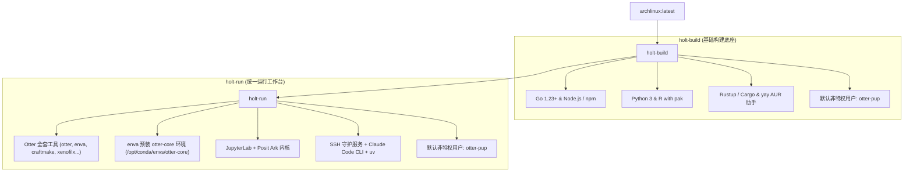

<p align="right">
  <a href="./README.md">English</a> · <strong>简体中文</strong>
</p>

<h1 align="center">🦦 HOLT</h1>

<p align="center">
  <strong>面向 Otter 生物信息学与多语言计算的现代化容器工作台</strong><br>
  集成分层 Docker 架构、原生 Otter 生信工具链、enva 极速 Conda 环境与现代开发者工具套件。
</p>

<p align="center">
  <a href="#🌟-项目概览">项目概览</a> ·
  <a href="#🏗️-架构设计">架构设计</a> ·
  <a href="#🚀-快速上手">快速上手</a> ·
  <a href="#🧰-otter-工具链集成">工具链集成</a> ·
  <a href="#💻-多语言开发栈">开发语言</a> ·
  <a href="#🔨-cicd--镜像发布">CI/CD</a> ·
  <a href="#📁-仓库目录结构">仓库结构</a>
</p>

<p align="center">
  <a href="https://github.com/otterlab-bio/holt/actions/workflows/holt-build.yml"></a>
  <a href="https://github.com/otterlab-bio/holt/actions/workflows/holt-run.yml"></a>
  <a href="https://github.com/orgs/otterlab-bio/packages"></a>
  <a href="LICENSE"></a>
</p>

---

## 🌟 项目概览

**Holt** 是专门为 [Otter](https://github.com/otterlab-bio/otter) 生物信息学生态及多语言计算研发设计的高性能容器套件。通过编译底座与运行环境的解耦，Holt 提供了两个职责清晰、相互继承的 Docker 镜像，全面托管于 **GitHub Container Registry (GHCR)**：

- 🛠️ **`ghcr.io/otterlab-bio/holt-build`**: 轻量级多语言基础构建层，基于 Arch Linux。开箱即用支持 Go、Node.js / npm、Python 3、R、Rust（`cargo`）以及 `yay` AUR 助手。运行于非特权专属用户 `otter-pup`。
- 🧬 **`ghcr.io/otterlab-bio/holt-run`**: 统一生物信息学工作台与运行镜像，派生自 `holt-build`。完整内置 Otter 全套官方二进制工具链，通过 `enva` 预安装 `otter-core` 生信环境，并整合 JupyterLab（带 Posit Ark 内核）、开机自启 SSH 守护服务与 AI 编程助手（`claude-code`、`uv`、`codex`）。

---

## 🏗️ 架构设计



---

## 📦 镜像特性对比

| 模块规范 | `holt-build` (基础构建镜像) | `holt-run` (统一运行镜像) |
| :--- | :--- | :--- |
| **基础底座** | `archlinux:latest` | `ghcr.io/otterlab-bio/holt-build:latest` |
| **默认用户** | `otter-pup` (免密 sudo 权限) | `otter-pup` (免密 sudo 权限) |
| **编程语言与包管理** | Go, Node.js, npm, Python 3, pip, R, pak, Rust (cargo) | 继承全部基础语言 + Python `uv` |
| **Otter 工具链** | — | 全套预装 (`otter`, `enva`, `craftmake`, `xenofilx`, `pairbam`, `seq2mat`, `methx`, `qctb`, `fastqcx`, `matsrun`) |
| **生信分析环境** | — | `otter-core` 预装就绪 (bismark, bowtie2, samtools, star, htseq, rmats, picard, fastqc, macs2, bwa...) |
| **交互与服务** | 交互式终端 Shell | SSH 服务 (端口 2222), JupyterLab (端口 8889) 带 Ark 内核 |
| **AI 编程助手** | — | Claude Code CLI (`claude-code`), OpenAI Codex, droid |
| **暴露端口** | — | `2222` (SSH), `8889` (JupyterLab), `8080`, `8787` (Web应用) |

---

## 🚀 快速上手

### 1. 从 GHCR 拉取预构建镜像

```bash
docker pull ghcr.io/otterlab-bio/holt-build:latest
docker pull ghcr.io/otterlab-bio/holt-run:latest
```

### 2. 启动容器

#### 启动 `holt-run` 工作台（推荐）

```bash
docker run -d \
  -p 2222:2222 \
  -p 8889:8889 \
  -p 8080:8080 \
  -p 8787:8787 \
  --name holt-run \
  ghcr.io/otterlab-bio/holt-run:latest
```

或使用仓库内置的 **Docker Compose** 一键编排：

```bash
docker compose up -d holt-run
```

#### 启动 `holt-build` 交互环境

```bash
docker run -it --name holt-build ghcr.io/otterlab-bio/holt-build:latest
```

### 3. 服务连接与使用

- **SSH 终端连接**（随容器启动自动就绪）：
  ```bash
  ssh otter-pup@localhost -p 2222
  # 默认登录密码: otter-pup
  ```

- **按需启动 JupyterLab**（降低闲置资源开销）：
  ```bash
  docker exec holt-run su - otter-pup -c "jupyter-lab --no-browser --allow-root --ip=* --port=8889" &
  ```
  在浏览器中访问：[http://localhost:8889](http://localhost:8889)

- **交互式创建与配置新用户**：
  ```bash
  docker exec -it holt-run sudo add-user
  ```
  向导将全自动引导创建新用户、配置专属家目录权限、sudo 权限、SSH 公钥授权以及多语言环境变量。

---

## 🧰 Otter 工具链集成

`holt-run` 完整内置了 [otterlab-bio/otter](https://github.com/otterlab-bio/otter) 官方发布的独立静态二进制工具，所有工具均已加入系统全局 `PATH`：

| 工具名称 | 功能说明 |
| :--- | :--- |
| **`otter`** | 核心生信工作流编排与执行引擎 |
| **`enva`** | 基于 Rattler 的现代化高性能 Conda/Mamba 环境管理器 |
| **`craftmake`** | 统一工作流定义与依赖执行客户端 |
| **`xenofilx`** | PDX/CDX 肿瘤异种移植人鼠混合测序数据快速过滤工具 |
| **`pairbam`** | 高性能双端 BAM 匹配与比对校准工具 |
| **`seq2mat`** | 测序数据与表达/甲基化矩阵极速转换工具 |
| **`methx`** | 高通量甲基化特征提取与分析套件 |
| **`qctb`** | 质量控制与测序指标综合评估工具 |
| **`fastqcx`** | 超快 FASTQ 质控与过滤工具 |
| **`matsrun`** | rMATS 可变剪接分析执行与结果提取封装工具 |

### 运行时环境 `otter-core`

容器在构建时已通过 `enva` 将 `otter-core` 环境完整安装至 `/opt/conda/envs/otter-core`，核心生信工具均可在任意终端直接调用：

```bash
# 验证容器内工具
docker exec -it holt-run bash

otter --version
enva list
samtools --version
bismark --version
bowtie2 --version
star --version
```

---

## 💻 多语言开发栈

`holt` 为主流系统级与生物信息学编程语言提供了第一梯队的开发支持：

```bash
# Go 开发
go version
go mod init my_project

# Node.js 与 npm
node -v
npm -v

# Python 与 uv
python --version
uv pip install numpy pandas

# Rust 开发
rustc --version
cargo --version

# AI 编程助手
claude-code
```

---

## 🔨 CI/CD 与 镜像发布

项目采用 GitHub Actions 实现自动化持续集成与 GHCR 镜像发布：

- **`.github/workflows/holt-build.yml`**: 监听 `main` 分支代码提交（及每周五定时构建），负责构建并推送 `ghcr.io/otterlab-bio/holt-build:latest`。
- **`.github/workflows/holt-run.yml`**: 在 `holt-build` 构建成功后通过 `workflow_run` 自动级联唤起，拉取最新底座并构建发布 `ghcr.io/otterlab-bio/holt-run:latest`。杜绝了重复并发与竞态冲突。

### 本地构建命令

```bash
# 本地构建基础镜像
docker build -t ghcr.io/otterlab-bio/holt-build:latest ./holt-build

# 本地构建运行镜像
docker build -t ghcr.io/otterlab-bio/holt-run:latest ./holt-run

# 或使用 Docker Compose 统一构建
docker compose build
```

---

## 📁 仓库目录结构

```
holt/
├── holt-build/
│   ├── Dockerfile             # 基础构建镜像 (Go, npm, Python, R, Rust, otter-pup)
│   └── makepkg.conf           # Arch Linux 多核并行编译配置
├── holt-run/
│   ├── Dockerfile             # 运行环境镜像 (Otter 全套工具, otter-core, JupyterLab, SSH)
│   ├── add_user_interactive.sh# 交互式新用户创建向导
│   └── envs/                  # Otter 生态环境定义 (otter-core.yaml 等)
├── .github/workflows/
│   ├── holt-build.yml         # GHCR 自动化构建与发布 (holt-build)
│   └── holt-run.yml           # 自动级联构建与发布 (holt-run)
├── docker-compose.yml         # 本地容器编排定义
├── README.md                  # 英文项目文档
├── README_zh.md               # 中文项目文档
├── CLAUDE.md                  # Claude Code 开发规范指南
├── LICENSE                    # MIT 开源许可证
├── .gitignore
├── .dockerignore
└── .gitattributes
```

---

## 📄 许可证

本项目基于 [MIT 许可证](LICENSE) 开源发布。
